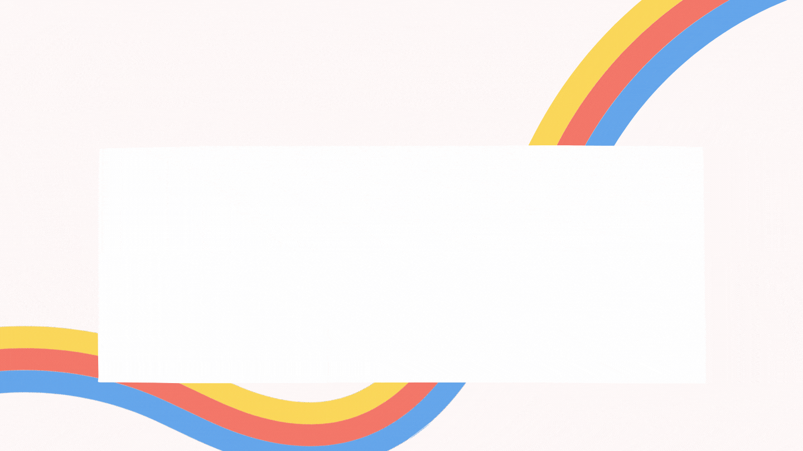

# Hello, folks! 

## 👦 About Me

- 🔭 I’m currently working as a Trainee at IEEE and ML intern at Digitran Soln.

- 🌱 I’m currently learning **ML, AI and Software Engineering**

- 👯 I’m looking to collaborate on **Metasploit Base Code**

- 📫 Contact me **(krnitish1207@gmail.com)**

## ✍ My Work

**Here are some of my projects on Github that I am proud of:**

## 📚 My Skills

## 🔧 Technologies & Tools

## 🤝 Connect

  

